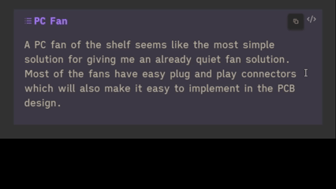
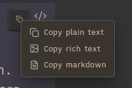
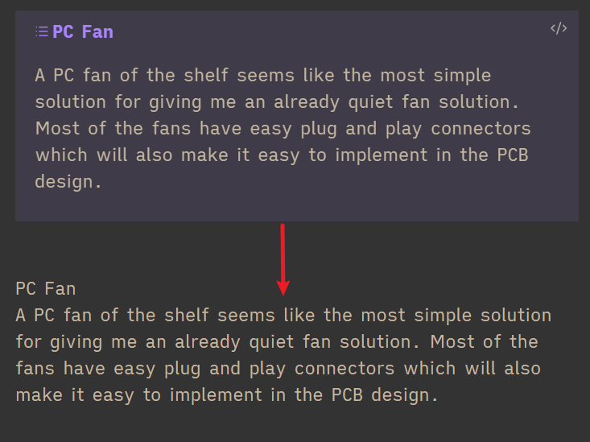
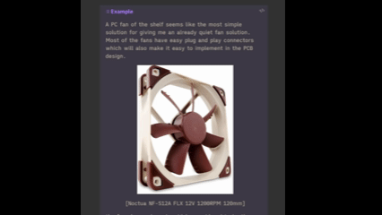
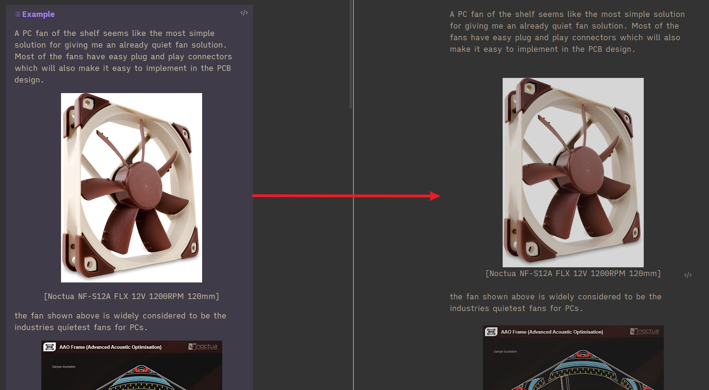

# Callout Copy

Copy content from Obsidian callouts with a one-click button, similar to Obsidian code block copy behavior.

---

## What this plugin does

Adds a copy button to callouts in:

- **Reading mode**
- **Live Preview mode**

Copy options:

- **Left-click button** → Copy **plain text** (default)
- **Right-click button** → Open menu:
  - Copy plain text
  - Copy rich text
  - Copy markdown

---

## Why plain text is default

Plain text is the safest default for quick paste back into Obsidian, especially in Live Preview, and avoids very large paste payloads that can happen with rich image data.

Use **Copy rich text** only when you specifically want formatted content with images where supported.

---

## Installation (manual)

1. Build the plugin:
   - `npm install`
   - `npm run build`
2. Copy these files into your vault plugin folder:
   - `main.js`
   - `manifest.json`
   - `styles.css`
3. In Obsidian:
   - Open **Settings → Community Plugins**
   - Enable this plugin

---

## How to use

### 1) Default quick copy (plain text)

1. Hover over a callout.
2. Click the copy button in the top-right.
3. Paste anywhere as plain text.

---

### 2) Open advanced copy menu

1. Hover over a callout copy button.
2. **Right-click** the copy button.
3. Choose a copy mode from the menu.

---

### 3) Copy mode details

#### Copy plain text

- Best for fast and predictable paste behavior.
- Includes callout title/content as rendered text.

#### Copy rich text

- Attempts to preserve formatting and images (where destination app supports rich paste).
- Also includes plain text fallback in clipboard payload.

#### Copy markdown

- Copies callout markdown content with title.
- Useful for editing/reusing note structure.

---

## Notes / known behavior

- Rich paste behavior can vary by destination app (Obsidian, Docs, chat apps, etc.).
- Source mode does not show rendered callout buttons the same way as Reading/Live Preview.

---

## Development

1. Install dependencies:
   - `npm install`
2. Build once:
   - `npm run build`
3. Watch mode:
   - `npm run dev`

Build output:

- `main.js` in project root.
